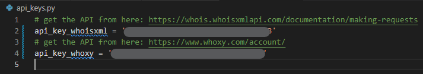
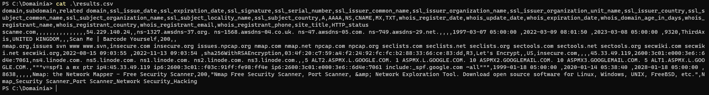
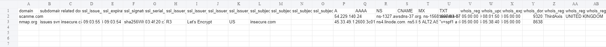

**Domainia** Scanner is an Open-source Intelligence (OSINT) tool that enumerates subdomains, all DNS records, IP addresses, related domains/subdomains, certificate details, site info, HTTP status, name servers (NS), domain whois, and etc. of a single domain or a list of domains by using the passive and active reconnaissance techniques.

# How to Use

## 0- Install Dependencies
By running the following command, it will install all required dependencies for the current user.
```Bash
pip install requirements.txt --user
```

## 1- Add API Keys
Modify the file `api_keys.py` and add the API keys of the mentioned tools.


## 2- Check the Configuration File
Open the file `config.py` and modify it if needed. For each section of it, there is an explanation as the comment.

There are many options can be modified in the config file. Here are a list of the options:
- `date_format` to set the data and time format
- `scan_type` to set the scan type
- `dns_records` to set which DNS records should be enumerated
- `include_txt_records` to set which TXT records should be written in the output file
- `dns_servers` to set the DNS servers
- `delimiter` to set the delimiters for each data to be written into the CSV file
- `whois` to set which Whois detail should be written into the CSV file
- `ssl` to set which SSL detail should be written into the CSV file
- `api` to modify details of the APIs including the data/time format

## 3- Run the Script
The script can be run in 2 modes, loading the list of domains from a file or from the command.
```bash
  -h, --help
                        Show this help message and exit
  -f FILE, --file FILE  
                        Path to the list of domain names, e.g. domains.txt
  -d DOMAIN, --domain DOMAIN
                        The comma separated list of domains
  -w WHOIS, --whois WHOIS
                        Whois API; default "whoisxml".
                        Possible options: "whoisxml" and "whoxy"
-t TYPE, --type TYPE  
                       Type of the scan. If it is set, it will ignore the config file value for the scan type.
                       Possible options: "quick" and "deep"
  -o OUTPUT, --output OUTPUT
                        The name of the output CSV file, e.g. results.csv
```


## 4- Results (CSV)
Result of the scan would be saved in a CSV file. You can manage the path of the output file by the argument `-o` or `--output`.



## Copyright
- This tool is released under copy left right. Read more about it on the LICENSE page.
- The logo is from [Freepik - Flaticon](https://www.flaticon.com/free-icons/connector).
